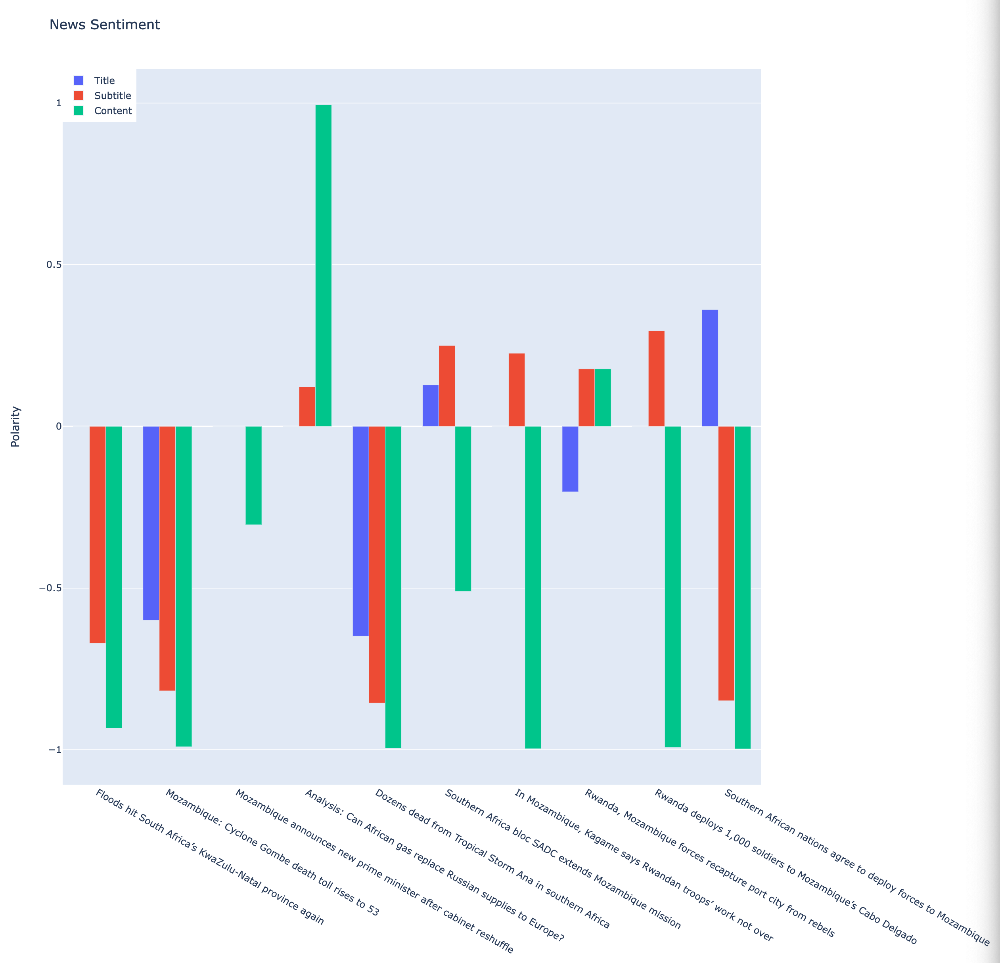

## Development

1. This project use virtual environment `venv` with python `3.10.4`.
2. Run `source bin/activate` on unix or MacOS to enable `venv`.
3. Run `python -m pip install -r requirements.txt` to install external libraries
4. Run `python src/__init__.py` to execute the program.

## Summary

- The project uses `beautifulsoup` and `requests` to do web crawling.
- To clean unnecessary data for the analysis, only title, subtitle and paragraphs of an article are saved in the json file.
- I use VADER Sentiment Analysis from `nltk` to detect the sentiment of each articles. When the score closes to 1, the sentiment is *positive*; when closing to -1, *negative*; otherwise, the sentiment is regarded as *neutral*.
- For the operation time, the `vader_lexicon` downloading time is omitted from the result.

    ```
    Web Scraping: 0.5891s
    Save JSON: 0.0012s
    Sentiment Analysis: 0.0731s
    Data Visualization: 0.0905s
    ------------------------------
    Operation time: 0.7541s
    ```

- For the only 10 articles, I don't aggregate the result but represent the each sentiment of the article parts.



- From the graph, we can see the following:
  - The recent 10 articles are mostly negative.
  - The title of the news is quite neutral.
  - Only one article shows positive sentiment.
  - Often, content and subtitle show different sentiment.
